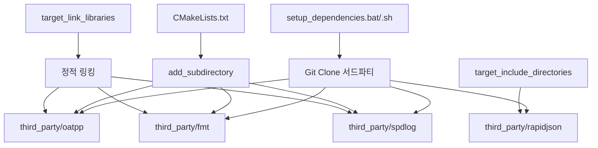
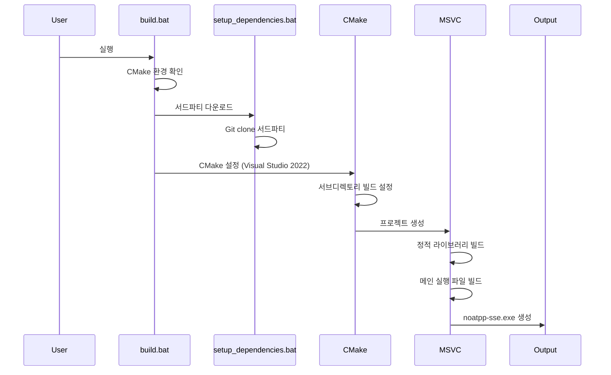
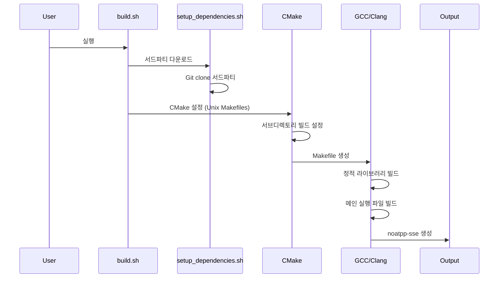

# 빌드 가이드

## 시스템 요구사항

### Windows (WSL/네이티브)
```bash
# WSL에서 빌드 도구 설치
sudo apt update
sudo apt install -y cmake build-essential git

# 또는 네이티브 Windows에서 Visual Studio 2022 사용
```

### Linux/Ubuntu
```bash
sudo apt update
sudo apt install -y cmake build-essential git
```

### macOS
```bash
# Xcode 명령행 도구 설치
xcode-select --install

# Homebrew를 통한 cmake 설치
brew install cmake
```

## 빌드 시스템 구조

### 전체 빌드 아키텍처

```
noatpp-sse/
├── CMakeLists.txt (메인 프로젝트 설정)
├── build.bat (Windows 빌드 스크립트)
├── build.sh (Linux/macOS 빌드 스크립트)
├── setup_dependencies.bat/.sh (서드파티 다운로드)
├── src/ (메인 소스 코드)
└── third_party/ (로컬 빌드 서드파티 라이브러리)
    ├── oatpp/ (웹 프레임워크)
    ├── fmt/ (포맷팅 라이브러리)
    ├── spdlog/ (로깅 라이브러리)
    ├── rapidjson/ (JSON 파싱 - 헤더 전용)
    └── oatpp-websocket/ (웹소켓 - 현재 비활성화)
```

### 서드파티 라이브러리 빌드 방식

#### 1. 로컬 빌드 (vcpkg 미사용)
모든 서드파티 라이브러리는 `third_party/` 디렉토리에 로컬로 다운로드되어 빌드됩니다.



#### 2. 서드파티 라이브러리별 빌드 방식

| 라이브러리 | 빌드 방식 | 설정 | 링킹 방식 |
|-----------|----------|------|----------|
| **oatpp** | CMake 서브디렉토리 | `OATPP_BUILD_SHARED=OFF` | 정적 라이브러리 |
| **fmt** | CMake 서브디렉토리 | `FMT_INSTALL=OFF` | 정적 라이브러리 |
| **spdlog** | CMake 서브디렉토리 | `SPDLOG_BUILD_SHARED=OFF` | 정적 라이브러리 |
| **rapidjson** | 헤더 전용 | 직접 포함 | 헤더만 포함 |

### 빌드 프로세스 상세

#### Windows 빌드 프로세스



#### Linux 빌드 프로세스



## 빌드 과정

### 1. 의존성 다운로드
```bash
# Linux/macOS
chmod +x setup_dependencies.sh
./setup_dependencies.sh

# Windows
setup_dependencies.bat
```

**다운로드되는 서드파티:**
- oatpp 1.3.0 (웹 프레임워크)
- fmt 10.2.1 (포맷팅 라이브러리)
- spdlog 1.12.0 (로깅 라이브러리)
- rapidjson v1.1.0 (JSON 파싱 - 헤더 전용)

### 2. 프로젝트 빌드

#### Linux/macOS
```bash
# 자동화된 빌드
chmod +x build.sh
./build.sh

# 또는 수동 빌드
mkdir build-linux && cd build-linux
cmake .. -DCMAKE_BUILD_TYPE=Release
cmake --build . -j$(nproc)
```

#### Windows
```batch
# 자동화된 빌드
build.bat

# 또는 수동 빌드
mkdir build-windows && cd build-windows
cmake .. -G "Visual Studio 17 2022" -A x64 -DCMAKE_BUILD_TYPE=Release
cmake --build . --config Release
```

### 3. 서버 실행
```bash
# Linux/macOS
./build-linux/noatpp-sse

# Windows
build-windows\Release\noatpp-sse.exe
```

## 빌드 설정 상세

### 정적 빌드 설정
```cmake
# 모든 라이브러리를 정적으로 빌드
set(BUILD_SHARED_LIBS OFF)
set(CMAKE_POSITION_INDEPENDENT_CODE ON)

# Windows에서 정적 런타임 사용
set(CMAKE_MSVC_RUNTIME_LIBRARY "MultiThreaded$<$<CONFIG:Debug>:Debug>")
```

### 서드파티 라이브러리 설정
```cmake
# oatpp 설정
set(OATPP_BUILD_SHARED OFF CACHE INTERNAL "")
set(OATPP_BUILD_TESTS OFF CACHE INTERNAL "")

# fmt 설정
set(FMT_INSTALL OFF CACHE INTERNAL "")
set(FMT_USE_WINDOWS_H OFF CACHE INTERNAL "")

# spdlog 설정
set(SPDLOG_BUILD_SHARED OFF CACHE INTERNAL "")
set(SPDLOG_FMT_EXTERNAL ON CACHE INTERNAL "")
```

### 링킹 설정
```cmake
# 정적 라이브러리 링킹
target_link_libraries(${PROJECT_NAME} PRIVATE
    oatpp
    fmt::fmt
    spdlog::spdlog
)

# Windows 전용 라이브러리
if(WIN32)
    target_link_libraries(${PROJECT_NAME} PRIVATE ws2_32 wsock32)
endif()
```

## 엔드포인트 테스트

서버가 포트 8081에서 실행 중일 때:

```bash
# 루트 엔드포인트 테스트
curl http://localhost:8081/

# 헬스 체크 엔드포인트 테스트
curl http://localhost:8081/api/health
```

예상 응답:
- `/` 반환: "Oatpp SSE Server is running!"
- `/api/health` 반환: 상태, 메시지, 타임스탬프가 포함된 JSON

## 빌드 출력 구조

### Windows 빌드 출력
```
build-windows/
├── Release/
│   ├── noatpp-sse.exe (메인 실행 파일)
│   └── [서드파티 라이브러리 파일들]
├── third_party/
│   ├── oatpp/src/Release/oatpp.lib
│   ├── fmt/Release/fmt.lib
│   └── spdlog/Release/spdlog.lib
└── [CMake 생성 파일들]
```

### Linux 빌드 출력
```
build-linux/
├── noatpp-sse (메인 실행 파일)
├── liboatpp.a
├── libfmt.a
├── libspdlog.a
└── [CMake 생성 파일들]
```

## 문제 해결

### 1. CMake 관련 문제
- **CMake를 찾을 수 없음**: cmake 패키지 설치 또는 Visual Studio CMake 사용
- **정적 라이브러리 빌드 실패**: `BUILD_SHARED_LIBS=OFF` 확인

### 2. 컴파일러 관련 문제
- **C++20 호환성**: GCC 10+, Clang 12+, MSVC 2019+ 필요
- **MSVC 인코딩 문제**: UTF-8 인코딩으로 파일 저장
- **RapidJSON 경고**: `_SILENCE_CXX17_ITERATOR_BASE_CLASS_DEPRECATION_WARNING` 플래그 사용

### 3. 네트워크 관련 문제
- **포트 충돌**: 기본 포트 8081 사용, 필요시 main.cpp에서 변경
- **바인딩 실패**: 포트 사용 가능 여부 확인

### 4. 의존성 관련 문제
- **Git 클론 실패**: 네트워크 연결 및 Git 설치 확인
- **서드파티 빌드 실패**: CMake 버전 3.20+ 필요

## 빌드 최적화

### 병렬 빌드
```bash
# Linux/macOS
cmake --build . -j$(nproc)

# Windows
cmake --build . --parallel
```

### 정적 링킹 장점
- 단일 실행 파일 생성
- 외부 의존성 없음
- 배포 용이성
- 성능 최적화

### 헤더 전용 라이브러리
- rapidjson은 헤더만 포함
- 별도 빌드 과정 불필요
- 컴파일 시간에 직접 포함