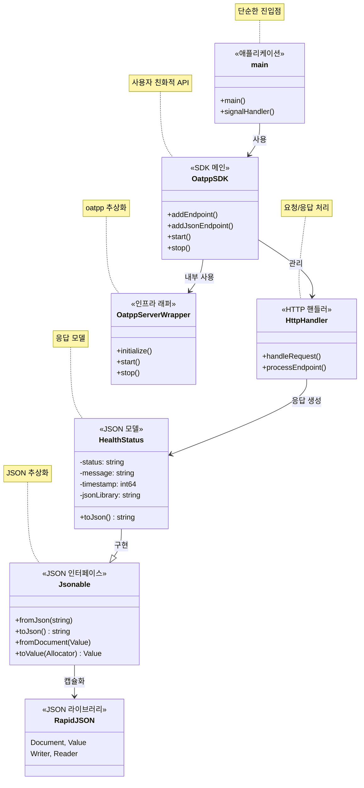

# Phase 1 SDK 아키텍처 문서 (Phase 1.5 포함)

## 개요

Phase 1은 단순한 사용성을 가진 C++ SDK의 기반을 구현합니다. 복잡한 웹 프레임워크 개념 대신 **API 서빙**과 **실시간 통신**에 집중한 단순한 핸들러 기반 아키텍처를 구축했습니다. Phase 1.5에서는 RapidJSON과 Jsonable 인터페이스를 도입하여 JSON 처리를 캡슐화했습니다.

## 아키텍처 다이어그램



### Phase 1.5 SDK 특징
- **단순한 사용성**: 복잡한 설정 없이 즉시 사용 가능
- **핸들러 기반**: 람다 함수로 간단한 엔드포인트 정의
- **JSON 캡슐화**: Jsonable 인터페이스로 RapidJSON 숨김
- **모듈화**: 필요한 기능만 선택적으로 포함
- **크로스 플랫폼**: Windows/Linux/macOS 지원

## 파일 구조

```
src/
├── main.cpp                                    # 예제 애플리케이션
├── sdk/
│   ├── OatppSDK.hpp                           # SDK 메인 클래스 (향후 구현)
│   └── handlers/
│       └── HttpHandler.hpp                     # HTTP 핸들러 (향후 구현)
├── domain/models/
│   └── HealthStatus.hpp                        # JSON 응답 모델
├── infrastructure/
│   ├── json/
│   │   ├── Jsonable.hpp                        # JSON 직렬화 인터페이스
│   │   └── JsonHelper.hpp                      # JSON 유틸리티
│   └── oatpp/
│       ├── OatppServerWrapper.hpp              # 서버 래퍼
│       └── OatppServerWrapper.cpp              # 서버 래퍼 구현
└── presentation/controllers/
    ├── HttpController.hpp                      # 현재 HTTP 컨트롤러
    └── HttpController.cpp                      # 현재 HTTP 컨트롤러 구현
```

## 클래스 책임

### 1. main.cpp
- **목적**: 애플리케이션 생명주기 관리
- **책임**:
  - 서버 인스턴스 생성 및 관리
  - 시그널 처리 (SIGINT, SIGTERM)
  - 우아한 종료
- **의존성**: OatppServerWrapper

### 2. OatppServerWrapper
- **목적**: Oatpp 프레임워크 추상화
- **책임**:
  - 서버 컴포넌트 초기화
  - 연결 제공자 설정
  - 요청 핸들러 구성
  - 서버 생명주기 관리
- **의존성**: oatpp 프레임워크 클래스들, HttpController

### 3. HttpController
- **목적**: HTTP 엔드포인트 구현
- **책임**:
  - REST API 엔드포인트 정의
  - 요청 처리
  - 응답 생성
- **의존성**: oatpp::ApiController, HealthStatus

### 4. Jsonable (새로 추가 - Phase 1.5)
- **목적**: JSON 직렬화/역직렬화 인터페이스 제공
- **책임**:
  - JSON 문자열 ↔ 객체 변환 인터페이스 정의
  - RapidJSON 구현 세부사항 캡슐화
  - 안전한 JSON 파싱 헬퍼 메서드 제공
- **의존성**: RapidJSON (내부적으로만)

### 5. HealthStatus (새로 추가 - Phase 1.5)
- **목적**: 서버 상태 정보 도메인 모델
- **책임**:
  - 서버 상태 데이터 캡슐화
  - JSON 직렬화/역직렬화 구현
  - 비즈니스 로직과 데이터 관리
- **의존성**: Jsonable 인터페이스

## 관계

### 소유 관계 (강한 결합)
1. `main`이 `OatppServerWrapper`를 소유 (unique_ptr)
2. `OatppServerWrapper`가 oatpp 컴포넌트들을 소유 (shared_ptr)

### 사용 관계 (약한 결합)
1. `OatppServerWrapper`가 라우팅을 위해 `HttpController` 사용
2. `HttpController`가 JSON 처리를 위해 `ObjectMapper` 사용
3. 모든 클래스가 메모리 관리를 위해 스마트 포인터 사용

### 의존성
1. `HttpConnectionHandler`가 `HttpRouter`에 의존
2. `Server`가 `ServerConnectionProvider`와 `HttpConnectionHandler`에 의존
3. `HttpController`가 `oatpp::ApiController`를 상속

## API 엔드포인트

### GET /
- **설명**: 루트 엔드포인트
- **응답**: 일반 텍스트 "Oatpp SSE Server is running!"
- **상태**: 200 OK

### GET /api/health
- **설명**: 헬스 체크 엔드포인트
- **응답**: 서버 상태가 포함된 JSON (HealthStatus 모델 사용)
- **형식**:
```json
{
  "status": "OK",
  "message": "Server is running",
  "timestamp": 1752975680,
  "json_library": "RapidJSON"
}
```
- **상태**: 200 OK
- **변경사항**: Phase 1.5에서 `json_library` 필드 추가 및 Jsonable 인터페이스 사용

## 빌드 구성

### 정적 링킹
- 모든 서드파티 라이브러리 정적 링크
- 런타임 의존성 최소화
- 실행 파일 크기: ~1.5MB (Linux)

### 크로스 플랫폼 지원
- Windows: Visual Studio 2022, 정적 런타임 (/MT)
- Linux: GCC 10+, 정적 라이브러리
- 분리된 빌드 디렉토리 (build-windows/, build-linux/)

### 의존성
- **oatpp**: HTTP 서버 프레임워크
- **RapidJSON**: JSON 처리 (헤더 전용) - Phase 1.5에서 nlohmann/json 교체
- **fmt**: 문자열 포맷팅
- **spdlog**: 로깅 프레임워크

## 1단계 성과 (Phase 1.5 포함)

✅ **기본 HTTP 서버**: 헬스 엔드포인트가 있는 기능적인 웹 서버  
✅ **크로스 플랫폼 빌드**: Windows 및 Linux 지원  
✅ **정적 링킹**: 자체 포함 실행 파일  
✅ **깔끔한 코드 구조**: 관심사의 분리  
✅ **메모리 안전성**: 스마트 포인터 사용  
✅ **오류 처리**: 우아한 종료 및 오류 관리  
✅ **Jsonable 인터페이스**: JSON 라이브러리 캡슐화 (Phase 1.5)  
✅ **RapidJSON 통합**: 성능 개선된 JSON 처리 (Phase 1.5)  
✅ **도메인 모델**: HealthStatus를 통한 비즈니스 로직 분리 (Phase 1.5)  

## 향후 SDK 개발 단계

### Phase 2: WebSocket 및 SSE SDK
- OatppSDK 클래스 구현
- Builder 패턴으로 간단한 설정
- WebSocket 핸들러 추가
- SSE 스트리밍 기능

### Phase 3: MCP 프로토콜 지원
- MCP 메시지 파싱 및 응답
- Tools, Resources, Prompts 핸들러
- AI 모델 통합을 위한 인터페이스

### Phase 4: SDK 완성 및 배포
- 헤더 온리 라이브러리로 패키징
- 예제 및 문서 완성
- CMake 패키지 지원
- 성능 최적화

## 기술 노트

### 메모리 관리
- 전체적으로 RAII 패턴 적용
- 자동 정리를 위한 스마트 포인터
- 수동 메모리 관리 없음

### 오류 처리
- 예외 기반 오류 처리
- 우아한 성능 저하
- 시그널 기반 종료

### 스레딩
- 단일 스레드 설계 (1단계)
- oatpp가 내부 스레딩 처리
- 스레드 안전한 서버 작업

### 보안 고려사항
- 컨트롤러에서 입력 검증
- 안전한 문자열 처리
- 디버그 정보 노출 없음

## 빌드 명령어

```bash
# Linux
./build.sh [clean]
./run.sh

# Windows  
build.bat [clean]
run.bat

# 정적 빌드 (Linux)
./build-static.sh [clean]
```

이 아키텍처는 단순함과 신뢰성을 유지하면서 더 복잡한 기능을 구축하기 위한 견고한 기반을 제공합니다.