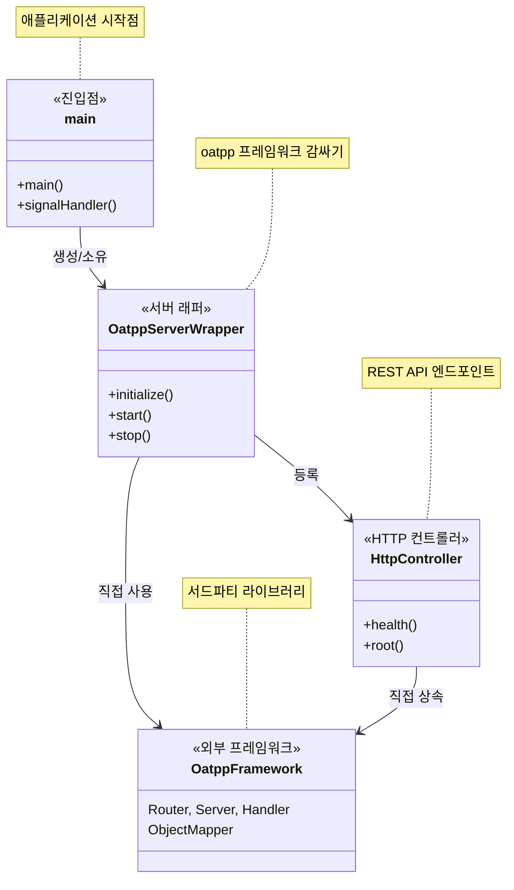

# 1단계 아키텍처 문서

## 개요

1단계는 oatpp 프레임워크를 사용하여 크로스 플랫폼 빌드 지원과 정적 링킹을 갖춘 기본 HTTP 서버를 구현합니다. 이 단계는 향후 WebSocket/SSE 기능을 위한 기반을 구축합니다.

## 아키텍처 다이어그램



### 현재 1단계 특징
- **단순한 구조**: 명확한 레이어 분리 없음
- **직접 의존성**: 각 클래스가 oatpp에 직접 의존
- **Wrapper 패턴**: OatppServerWrapper가 복잡성 숨김
- **향후 확장 준비**: Clean Architecture 적용 예정 (2-4단계)

## 파일 구조

```
src/
├── main.cpp                                    # 애플리케이션 진입점
├── infrastructure/oatpp/
│   ├── OatppServerWrapper.hpp                 # 서버 래퍼 인터페이스
│   └── OatppServerWrapper.cpp                 # 서버 래퍼 구현
└── presentation/controllers/
    ├── HttpController.hpp                      # HTTP 컨트롤러 인터페이스
    └── HttpController.cpp                      # HTTP 컨트롤러 구현
```

## 클래스 책임

### 1. main.cpp
- **목적**: 애플리케이션 생명주기 관리
- **책임**:
  - 서버 인스턴스 생성 및 관리
  - 시그널 처리 (SIGINT, SIGTERM)
  - 우아한 종료
- **의존성**: OatppServerWrapper

### 2. OatppServerWrapper
- **목적**: Oatpp 프레임워크 추상화
- **책임**:
  - 서버 컴포넌트 초기화
  - 연결 제공자 설정
  - 요청 핸들러 구성
  - 서버 생명주기 관리
- **의존성**: oatpp 프레임워크 클래스들, HttpController

### 3. HttpController
- **목적**: HTTP 엔드포인트 구현
- **책임**:
  - REST API 엔드포인트 정의
  - 요청 처리
  - 응답 생성
- **의존성**: oatpp::ApiController, ObjectMapper

## 관계

### 소유 관계 (강한 결합)
1. `main`이 `OatppServerWrapper`를 소유 (unique_ptr)
2. `OatppServerWrapper`가 oatpp 컴포넌트들을 소유 (shared_ptr)

### 사용 관계 (약한 결합)
1. `OatppServerWrapper`가 라우팅을 위해 `HttpController` 사용
2. `HttpController`가 JSON 처리를 위해 `ObjectMapper` 사용
3. 모든 클래스가 메모리 관리를 위해 스마트 포인터 사용

### 의존성
1. `HttpConnectionHandler`가 `HttpRouter`에 의존
2. `Server`가 `ServerConnectionProvider`와 `HttpConnectionHandler`에 의존
3. `HttpController`가 `oatpp::ApiController`를 상속

## API 엔드포인트

### GET /
- **설명**: 루트 엔드포인트
- **응답**: 일반 텍스트 "Oatpp SSE Server is running!"
- **상태**: 200 OK

### GET /api/health
- **설명**: 헬스 체크 엔드포인트
- **응답**: 서버 상태가 포함된 JSON
- **형식**:
```json
{
  "status": "OK",
  "message": "Server is running",
  "timestamp": 1752951542
}
```
- **상태**: 200 OK

## 빌드 구성

### 정적 링킹
- 모든 서드파티 라이브러리 정적 링크
- 런타임 의존성 최소화
- 실행 파일 크기: ~1.5MB (Linux)

### 크로스 플랫폼 지원
- Windows: Visual Studio 2022, 정적 런타임 (/MT)
- Linux: GCC 10+, 정적 라이브러리
- 분리된 빌드 디렉토리 (build-windows/, build-linux/)

### 의존성
- **oatpp**: HTTP 서버 프레임워크
- **nlohmann/json**: JSON 처리 (헤더 전용)
- **fmt**: 문자열 포맷팅
- **spdlog**: 로깅 프레임워크

## 1단계 성과

✅ **기본 HTTP 서버**: 헬스 엔드포인트가 있는 기능적인 웹 서버  
✅ **크로스 플랫폼 빌드**: Windows 및 Linux 지원  
✅ **정적 링킹**: 자체 포함 실행 파일  
✅ **깔끔한 코드 구조**: 관심사의 분리  
✅ **메모리 안전성**: 스마트 포인터 사용  
✅ **오류 처리**: 우아한 종료 및 오류 관리  

## 향후 단계

### 2단계: WebSocket 지원
- WebSocket 엔드포인트 추가
- JSON-RPC 2.0 프로토콜 구현
- 구독 관리 추가

### 3단계: SSE 구현
- Server-Sent Events 엔드포인트
- 이벤트 스트리밍 기능
- 클라이언트 연결 관리

### 4단계: Clean Architecture
- 도메인 레이어 분리
- 애플리케이션 서비스
- 리포지토리 패턴
- 의존성 주입

## 기술 노트

### 메모리 관리
- 전체적으로 RAII 패턴 적용
- 자동 정리를 위한 스마트 포인터
- 수동 메모리 관리 없음

### 오류 처리
- 예외 기반 오류 처리
- 우아한 성능 저하
- 시그널 기반 종료

### 스레딩
- 단일 스레드 설계 (1단계)
- oatpp가 내부 스레딩 처리
- 스레드 안전한 서버 작업

### 보안 고려사항
- 컨트롤러에서 입력 검증
- 안전한 문자열 처리
- 디버그 정보 노출 없음

## 빌드 명령어

```bash
# Linux
./build.sh [clean]
./run.sh

# Windows  
build.bat [clean]
run.bat

# 정적 빌드 (Linux)
./build-static.sh [clean]
```

이 아키텍처는 단순함과 신뢰성을 유지하면서 더 복잡한 기능을 구축하기 위한 견고한 기반을 제공합니다.